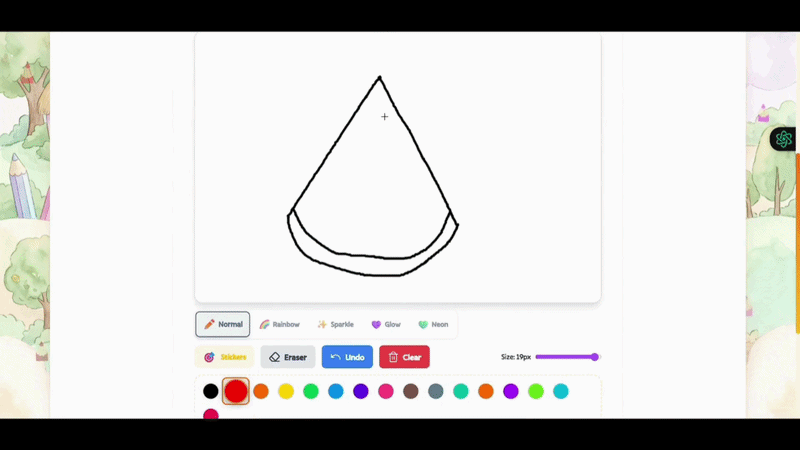
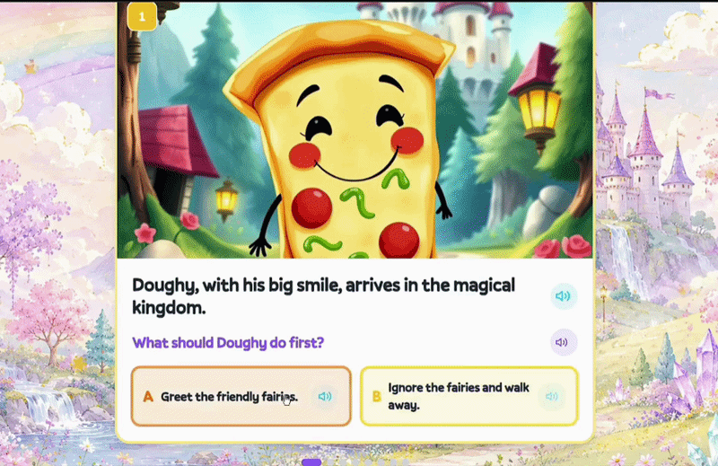
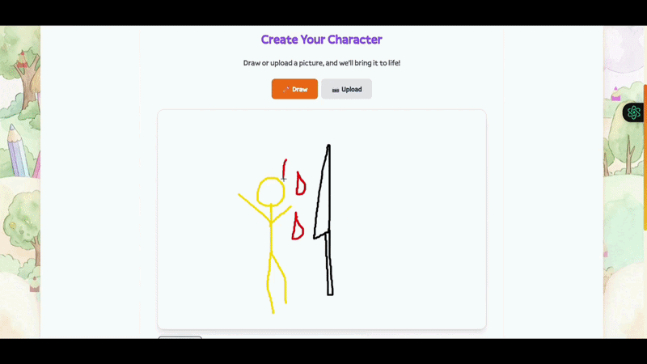

<p align="center">
  
</p>

<h1 align="center">Fablecraft</h1>

<p align="center">
  <strong>Turn your child's drawings into AI-powered interactive story adventures that teach real life lessons.</strong>
</p>

<p align="center">
  <a href="https://fablecraft-pi.vercel.app">🔗 Live Demo (Vercel)</a> •
  <a href="https://youtu.be/NEK5weMjHb4">🎬 Demo Video</a> •
  <a href="https://github.com/Shyamistic/FableCraft">💻 GitHub</a>
</p>

---

## H0 Hackathon — Track 1: Monetizable B2C App

> **AWS Database:** Amazon DynamoDB (PAY_PER_REQUEST, single-table design)  
> **Frontend:** Scaffolded with **Vercel v0** → deployed on **Vercel**  
> **Backend:** FastAPI on AWS EC2  
> **AI:** Amazon Bedrock (Nova Pro, Nova Canvas, Nova Lite) + Amazon Polly Neural  

---

## 🎬 Demo

[](https://youtu.be/NEK5weMjHb4)

**🔗 Live App:** [https://fablecraft-pi.vercel.app](https://fablecraft-pi.vercel.app)

---

## The Problem

Kids spend 3+ hours daily on screens — but almost none of it is creative. They watch, scroll, and tap — but rarely **create**.

**Fablecraft asks:** What if a 5-year-old's drawing session could become a personalized AI storybook that teaches them about sharing, honesty, or being brave?

We don't replace creativity with AI — we **amplify** it. The child draws. The AI responds. Together they make something neither could alone.

---

## How It Works

<p align="center">
  
  <br/>
  <em>A child's drawing transformed into an AI character by Amazon Nova</em>
</p>

| Step | What Happens | AWS Service |
|------|-------------|-------------|
| 🖌️ **Draw** | Child draws on canvas or uploads a photo | — |
| ✨ **Analyze** | AI understands the drawing (colors, type, mood) | **Amazon Bedrock (Nova Pro)** — Vision |
| 🎨 **Generate** | Character image created in storybook style | **Amazon Bedrock (Nova Canvas)** — Image Gen |
| 📖 **Learn** | Pick a life lesson (sharing, kindness, courage...) | **Amazon Bedrock (Nova Lite)** — Moderation |
| 🌍 **Explore** | Choose a world: Fantasy, Space, Underwater, Jungle | — |
| 🎮 **Play** | 8-scene interactive quest with choices | **Amazon Bedrock (Nova Pro)** — Story Gen |
| 🔊 **Listen** | Every scene narrated aloud with warm voice | **Amazon Polly Neural** (Ruth) |
| 💾 **Save** | All progress persisted across sessions | **Amazon DynamoDB** |
| 📦 **Store** | Images and audio stored securely | **Amazon S3** |

---

## Screenshots

<p align="center">
  
  <br/>
  <em>AI Character Generation — Drawing analyzed by Nova Pro, illustrated by Nova Canvas</em>
</p>

<p align="center">
  
  <br/>
  <em>Interactive Story Quest — 8 scenes generated by Amazon Bedrock, narrated by Amazon Polly</em>
</p>

<p align="center">
  
  <br/>
  <em>Content Moderation — Amazon Nova Lite keeps the experience safe for children</em>
</p>

<p align="center">
  
  <br/>
  <em>Full quest flow — from lesson selection to interactive gameplay</em>
</p>

<p align="center">
  
  <br/>
  <em>Scene-by-scene gameplay with AI-generated illustrations and narration</em>
</p>

<p align="center">
  
  <br/>
  <em>Gamification — XP, levels, coins, achievements, and daily streaks</em>
</p>

---

## Built with Vercel v0 + AWS

### Frontend: Scaffolded with Vercel v0

The frontend was scaffolded using **Vercel v0** to rapidly generate production-ready React components for:
- Drawing canvas with magic brushes and stickers
- Interactive story quest UI with scene navigation
- Gamification components (XP bars, achievement toasts, streak counters)
- Parent dashboard with PIN protection
- Responsive, accessible (WCAG AA) layout

v0 enabled us to go from idea to polished UI in minutes, then connect it to a production-grade AWS backend.

### Backend: Full AWS Stack

Every backend operation runs on AWS services — no third-party AI APIs required for the core flow:

```
Child's Drawing
     │
     ▼
┌─────────────────────────────────────────────────────────┐
│  Amazon Bedrock (Nova Pro) — Vision Analysis             │
│  "A purple dragon with golden wings, whimsical style"    │
└─────────────────────────────┬───────────────────────────┘
                              │
                              ▼
┌─────────────────────────────────────────────────────────┐
│  Amazon Bedrock (Nova Canvas) — Image Generation         │
│  → Illustrated character in children's book style        │
└─────────────────────────────┬───────────────────────────┘
                              │
                              ▼
┌─────────────────────────────────────────────────────────┐
│  Amazon Bedrock (Nova Pro) — Story Generation            │
│  → 8 interactive scenes with choices & consequences      │
└─────────────────────────────┬───────────────────────────┘
                              │
                              ▼
┌─────────────────────────────────────────────────────────┐
│  Amazon Bedrock (Nova Canvas) — Scene Illustration       │
│  → 8 unique scene artworks in matching style             │
└─────────────────────────────┬───────────────────────────┘
                              │
                              ▼
┌─────────────────────────────────────────────────────────┐
│  Amazon Polly Neural (Ruth) — Narration                  │
│  → Warm, expressive text-to-speech for each scene        │
└─────────────────────────────┬───────────────────────────┘
                              │
                              ▼
┌─────────────────────────────────────────────────────────┐
│  Amazon S3 — Asset Storage                               │
│  → All images, audio, drawings (presigned URLs, 1hr)     │
└─────────────────────────────┬───────────────────────────┘
                              │
                              ▼
┌─────────────────────────────────────────────────────────┐
│  Amazon DynamoDB — Data Persistence                      │
│  → User progress, characters, quests, achievements       │
└─────────────────────────────────────────────────────────┘
```

---

## AWS Services Deep Dive

### 🗄️ Amazon DynamoDB (Primary Database)

**Table:** `fablecraft-data` | **Billing:** PAY_PER_REQUEST | **Region:** us-east-1

Single-table design for maximum efficiency at any scale:

```
PK: USER#<uuid>    SK: PROFILE         → User profile (anonymous, privacy-first)
PK: USER#<uuid>    SK: PROGRESS        → XP, coins, levels, achievements, streaks
PK: USER#<uuid>    SK: CHAR#<uuid>     → Character records (drawing → AI character)
PK: USER#<uuid>    SK: QUEST#<uuid>    → Quest history with completion tracking
PK: USER#<uuid>    SK: SESSION#<uuid>  → Active gameplay state
```

**Why DynamoDB:**
- **Serverless** — Zero provisioning, automatic scaling 0 → millions req/sec
- **Single-digit ms latency** — Critical for children's engagement
- **PAY_PER_REQUEST** — $0 idle, pennies at hackathon scale, dollars at millions
- **Global Tables** — One-click multi-region for international launch
- **Atomic counters** — Perfect for XP, coins, and progress tracking

### 🧠 Amazon Bedrock (AI Backbone)

| Model | Task | Why This Model |
|-------|------|----------------|
| **Nova Pro v1:0** | Vision analysis | Best multimodal understanding for children's art |
| **Nova Pro v1:0** | Story generation | Creative, structured, safe output for kids |
| **Nova Lite v1:0** | Content moderation | Fast + cheap safety checks at every input |
| **Nova Canvas v1:0** | Image generation | Native AWS, no external API deps, consistent style |

### 🔊 Amazon Polly Neural

- **Voice:** Ruth (Neural) — warm, expressive, perfect for storytelling
- **Speed:** 90% (slightly slower for young listeners ages 4-8)
- **Output:** MP3 → stored in S3 → served via presigned URL
- **SSML:** Prosody control for emotional narration

### 📦 Amazon S3

- Character images, scene illustrations, TTS audio, original drawings
- Presigned URLs with 1-hour expiry (security)
- Content-Type aware serving

### 🖥️ Amazon EC2

- FastAPI backend with IAM role-based access (`fablecraft-ec2-role`)
- Docker container with auto-restart
- Scoped IAM: DynamoDB + S3 + Bedrock + Polly only

---

## 🚀 Next: Amazon Nova Reel (Animated Stories)

<p align="center">
  
  <br/>
  <em>Future: Nova Reel will animate each scene into a video clip</em>
</p>

Our architecture is already prepared for **Amazon Nova Reel** integration:

```
Current:  Drawing → Character → Static Scenes → Audio Narration
Future:   Drawing → Character → Animated Scenes → Audio Narration

Nova Reel: Scene artwork + narrative → 6-second animated clip per scene
8 scenes × 6 seconds = ~48 second personalized animated storybook
```

This positions Fablecraft as the **first AI platform to transform a child's drawing into a complete animated short film** — entirely powered by AWS.

---

## Architecture Diagram

```
┌─────────────────────────────────────────────────────────────────────────────────┐
│                          VERCEL (v0 Scaffolded Frontend)                          │
│  Next.js 14 • React 18 • TypeScript • Tailwind CSS                              │
│  Drawing Canvas • Quest UI • Gamification • Parent Dashboard                     │
│  Vercel Rewrites: /api/* → EC2 (HTTPS proxy)                                    │
└──────────────────────────────────────────┬──────────────────────────────────────┘
                                           │
                                           ▼
┌─────────────────────────────────────────────────────────────────────────────────┐
│                       AWS EC2 (FastAPI + Python)                                  │
│                                                                                  │
│  ┌─────────────┐ ┌──────────────┐ ┌────────────────┐ ┌───────────────────────┐ │
│  │   Vision    │ │    Quest     │ │     Scene      │ │   Content Moderator   │ │
│  │  Analyzer   │ │   Engine     │ │  Illustrator   │ │   (Child Safety)      │ │
│  │ (Nova Pro)  │ │ (Nova Pro)   │ │ (Nova Canvas)  │ │   (Nova Lite)         │ │
│  └─────────────┘ └──────────────┘ └────────────────┘ └───────────────────────┘ │
│  ┌─────────────┐ ┌──────────────┐ ┌────────────────┐ ┌───────────────────────┐ │
│  │  Character  │ │     TTS      │ │    Database    │ │   Collab Manager      │ │
│  │  Generator  │ │   Service    │ │     Layer      │ │   (WebSocket)         │ │
│  │(Nova Canvas)│ │(Polly Neural)│ │  (DynamoDB)    │ │                       │ │
│  └─────────────┘ └──────────────┘ └────────────────┘ └───────────────────────┘ │
└───────┬───────────────────────┬───────────────────────┬─────────────────────────┘
        │                       │                       │
        ▼                       ▼                       ▼
┌────────────────┐   ┌──────────────────┐   ┌─────────────────────────────────────┐
│ Amazon DynamoDB│   │   Amazon S3      │   │      Amazon Bedrock + Polly         │
│                │   │                  │   │                                     │
│ fablecraft-data│   │ fablecraft-assets│   │  Nova Pro   — Vision + Stories      │
│ PAY_PER_REQUEST│   │                  │   │  Nova Canvas— Image Generation      │
│                │   │ • Character imgs │   │  Nova Lite  — Content Moderation    │
│ • Users        │   │ • Scene artwork  │   │  Polly Ruth — Neural Narration      │
│ • Characters   │   │ • TTS audio MP3  │   │                                     │
│ • Quests       │   │ • Original draws │   │                                     │
│ • Progress     │   │                  │   │                                     │
│ • Sessions     │   │ Presigned URLs   │   │                                     │
│                │   │ (1hr expiry)     │   │                                     │
└────────────────┘   └──────────────────┘   └─────────────────────────────────────┘
```

---

## Content Safety — Built for Kids

<p align="center">
  
</p>

Every input is filtered through **Amazon Bedrock (Nova Lite)** content moderation:
- ✅ Drawings analyzed before processing
- ✅ Custom lessons validated for age-appropriateness  
- ✅ AI output filtered for child safety
- ✅ Gentle, shame-free messaging when content is blocked

---

## Monetization Strategy

| Tier | Price | Features |
|------|-------|----------|
| **Free** | $0 | 2 quests/day, basic brushes, 3 worlds |
| **Explorer** | $4.99/mo | Unlimited quests, all brushes, all worlds, character gallery |
| **Family** | $9.99/mo | Up to 4 kids, parent analytics, downloadable storybooks, animated stories |

**Unit Economics:** ~$0.08/quest (Bedrock + S3 + Polly + DynamoDB) → **60x margin** on Explorer tier  
**Target Market:** $7.6B children's educational app market

---

## Running Locally

### Prerequisites
- Python 3.11+, Node.js 18+
- AWS account with Bedrock model access (Nova Pro, Nova Canvas, Nova Lite)
- AWS CLI configured (`aws configure`)

### Backend
```bash
cd agents_service
pip install -r requirements.txt
python setup_dynamodb.py          # Creates DynamoDB table
uvicorn main:app --host 0.0.0.0 --port 8080
```

### Frontend
```bash
cd frontend
npm install
npm run dev
```

### Deploy to Vercel
```bash
cd frontend
npx vercel --prod
```

---

## Environment Variables

See [`agents_service/.env.example`](agents_service/.env.example) for all configuration. Key AWS settings:

```env
AWS_REGION=us-east-1
DYNAMODB_TABLE_NAME=fablecraft-data
S3_BUCKET_NAME=fablecraft-assets
BEDROCK_VISION_MODEL=amazon.nova-pro-v1:0
BEDROCK_QUEST_MODEL=amazon.nova-pro-v1:0
BEDROCK_MODERATION_MODEL=amazon.nova-lite-v1:0
BEDROCK_IMAGE_MODEL=amazon.nova-canvas-v1:0
POLLY_VOICE_ID=Ruth
POLLY_ENGINE=neural
```

---

## Submission Checklist

- [x] **AWS Database:** Amazon DynamoDB (`fablecraft-data`, PAY_PER_REQUEST, single-table)
- [x] **Frontend:** Scaffolded with v0, deployed on Vercel
- [x] **Demo Video:** [YouTube](https://youtu.be/NEK5weMjHb4) (< 3 minutes)
- [x] **Architecture Diagram:** Included above
- [x] **Vercel Project:** https://fablecraft-pi.vercel.app
- [x] **AWS Database Screenshot:** DynamoDB console with live data
- [x] **Track:** Monetizable B2C App (EdTech for families)

---

## Built With

<p align="center">
  
  <br/>
  <em>The full AI pipeline — from drawing to narrated interactive story</em>
</p>

- **Amazon DynamoDB** — Serverless database (user data, progress, history)
- **Amazon Bedrock** — Nova Pro, Nova Canvas, Nova Lite (AI backbone)
- **Amazon Polly Neural** — Text-to-speech narration
- **Amazon S3** — Asset storage
- **Amazon EC2** — Backend hosting
- **Vercel + v0** — Frontend scaffolding and deployment
- **Next.js 14** — React framework
- **FastAPI** — Python API framework
- **TypeScript + Tailwind CSS** — Type-safe, responsive UI

---

<p align="center">
  Built with ❤️ for the <strong>H0: Hack the Zero Stack with Vercel v0 and AWS Databases</strong> hackathon.
  <br/><br/>
  #H0Hackathon
</p>
